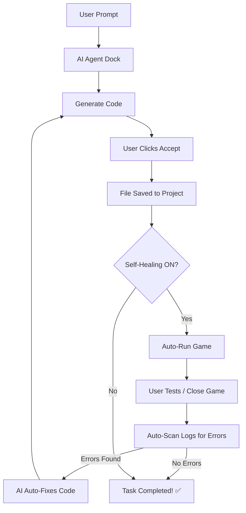

# 🤖 Godot AI Agent — Your Professional Game Dev Partner

An advanced AI sidebar plugin for **Godot 4.x** that gives you full control over your project through natural conversation. Think of it as **GitHub Copilot + Claude Artifacts**, but built specifically for the Godot Editor.

Powered by **moonshotai/kimi-k2-instruct** via **NVIDIA API** for state-of-the-art GDScript intelligence.

> **🚀 No Middleman:** No Python, no external servers, and no complex setup. Everything runs natively inside Godot using GDScript.

---

## ✨ Features that WOW

| Feature                         | Description                                                                                                  |
| :------------------------------ | :----------------------------------------------------------------------------------------------------------- |
| 🔄 **Self-Healing Loop**        | **PREMIUM:** AI automatically runs your game after edits, monitors for crashes, and fixes bugs autonomously! |
| 🎙️ **Conversational Assistant** | Discuss game design, performance, and logic like you're talking to a senior developer.                       |
| 🛡️ **Unified Diff Preview**     | Review every single line of code the AI wants to change in a beautiful side-by-side view.                    |
| ⚡ **Lightning Fast Save**      | Optimized project scanning (`fs.scan()`) for near-instant file operations.                                   |
| ▶️ **Integrated Debugging**     | Run Main Scene, Current Scene, or Stop execution directly from the AI sidebar.                               |
| 📝 **Full Project Access**      | AI can read, create, edit, and delete `.gd`, `.tscn`, and `.tres` files.                                     |
| 🔧 **Smart Error Fixer**        | Reads your Godot logs and fixes script errors automatically.                                                 |
| 🧩 **Node Architect**           | AI helps design node structures and generates the scene files (`.tscn`) for you.                             |

---

## 🛠️ Modern Architecture (Native 6-File Design)

The entire agent is contained within just 6 specialized GDScript files, making it lightweight and easy to maintain:

```text
addons/godot_ai_agent/
├── plugin.cfg               ← Manifest & Metadata
├── plugin.gd                ← Entry point & Editor integration
├── dock.gd                  ← The "Brain" (UI, Logic, Diff Viewer, Self-Healing)
├── kimi_client.gd           ← NVIDIA API Connector (High Performance)
├── project_scanner.gd       ← File tree & Context builder
└── ghost_autocomplete.gd    ← AI-powered "Ghost" code completion
```

---

## 🚀 Getting Started in 60 Seconds

1.  **Installation**: Copy the `addons/godot_ai_agent/` folder into your project's `addons/` directory.
2.  **Activation**: Go to **Project → Project Settings → Plugins** and enable **Godot AI Agent**.
3.  **Authentication**: Click the **⚙️** icon in the AI Sidebar, paste your **NVIDIA API Key**.
    > 💡 Get your free key at [build.nvidia.com](https://build.nvidia.com)

---

## 💬 Try These Commands

- _"Buat sistem musuh yang mengejar pemain dan gunakan Self-Healing untuk tes sampai berhasil."_
- _"Create a character controller with dash and double jump, then SAVE it to player.gd"_
- _"Look at my error log and fix why the portal isn't working."_
- _"Explain how this shader calculates the water waves."_
- _"Generate a main menu scene with 'Start' and 'Quit' buttons."_

---

## 🔧 Workflow: Self-Healing Loop



---

## 📄 License

**MIT** — Free to use, modify, and distribute. Build something amazing!
