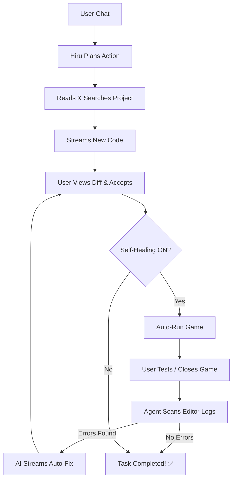

# 🤖 Hiru — Premium Godot AI Agent

An advanced, elite-level AI programming agent for **Godot 4.x** (named **Hiru**). Built with a premium aesthetic and capabilities inspired by **Cursor**, **Copilot**, and **Windsurf**. Hiru doesn't just autocomplete code; it reads your project files, plans its actions, and modifies your game directly—all while you watch.

Powered by **moonshotai/kimi-k2-instruct** (or your choice of **Llama 3.1 405B**, **Mistral**, **Nemotron**, etc.) via the **NVIDIA API**.

> **🚀 No Middleman:** No Python, no external servers, and no complex setup. Everything runs natively inside Godot using GDScript via direct Server-Sent Events (SSE).

---

## ✨ Pro-Agent Capabilities

| Feature                     | Description                                                                                      |
| :-------------------------- | :----------------------------------------------------------------------------------------------- |
| ⚡ **Real-Time Streaming**  | Watch the AI type its responses token-by-token instantly. No more waiting!                       |
| 🧠 **Chain-of-Thought**     | Hiru is forced to plan step-by-step ("Understand -> Plan -> Execute") before coding.             |
| 📡 **Live Activity Feed**   | Similar to Cursor, see a live feed of what the AI is currently doing _(Reading... Scanning...)_. |
| 🔄 **Self-Healing Loop**    | AI automatically runs your game after edits, monitors logs, and fixes bugs autonomously!         |
| 🛡️ **Auto-Fix Compliance**  | Strict GDScript formatting enforcement + automatic syntax checks to prevent bad code.            |
| 💎 **Premium UI**           | A sleek, dark, glassmorphic interface that feels like a professional IDE dev tool.               |
| 🛠️ **Unified Diff Preview** | Review every line of code change in a beautiful side-by-side view before accepting.              |

---

## 🛠️ Lightweight Native Architecture

The entire agent is contained within an incredibly clean GDScript architecture:

```text
addons/godot_ai_agent/
├── plugin.cfg               ← Manifest & Metadata
├── plugin.gd                ← Entry point & Editor integration
├── dock.gd                  ← Agent UI, Streaming Logic, System Prompts, Action Handlers
├── kimi_client.gd           ← NVIDIA API Connector with SSE Streaming Support
├── project_scanner.gd       ← File system abstraction, context builder & log parser
└── ghost_autocomplete.gd    ← AI-powered "Ghost" text completion for your code
```

---

## 🚀 Getting Started in 60 Seconds

1.  **Installation**: Copy `addons/godot_ai_agent/` into your project's `addons/` directory.
2.  **Activation**: Enable **Godot AI Agent** in **Project Settings → Plugins**.
3.  **Authentication**: Click the **⚙️** icon in the header, paste your **NVIDIA API Key**.
    > 💡 Get your free API key at [build.nvidia.com](https://build.nvidia.com)

---

## 🔧 Workflow: Autonomous Loop



---

## 📄 License

This software is released under the **MIT License**. Free to use, modify, and distribute. Build something amazing!
